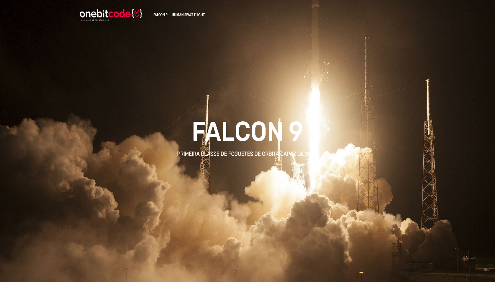

<h1 align="center"> Space-X </h1>

Uma página inspirada no site da Space-X.   

  <a href="#-tecnologias">Tecnologias</a>&nbsp;&nbsp;&nbsp;|&nbsp;&nbsp;&nbsp;
  <a href="#-projeto">Projeto</a>&nbsp;&nbsp;&nbsp;|&nbsp;&nbsp;&nbsp;
  <a href="#-layout">Layout</a>&nbsp;&nbsp;&nbsp;|&nbsp;&nbsp;&nbsp;
  <a href="#memo-licença">Licença</a>

  

 

  

## 🚀 Tecnologias

Esse projeto foi desenvolvido com as seguintes tecnologias:

- HTML
- Sass
- Bootstrap
- Git e Github

## 💻 Projeto

Uma página inspirada no Site da Space-X. Contendo 3 páginas a Home, Falcon-9 e a Human Space Flight

---
